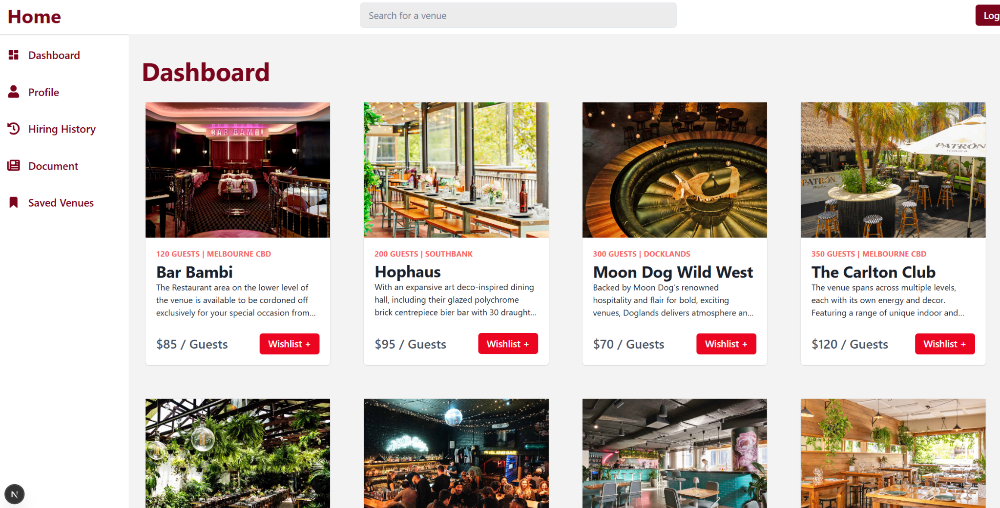
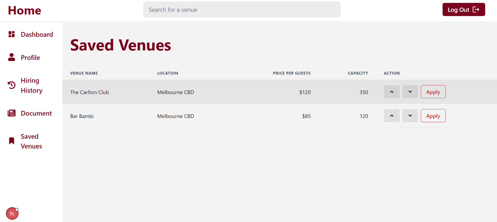
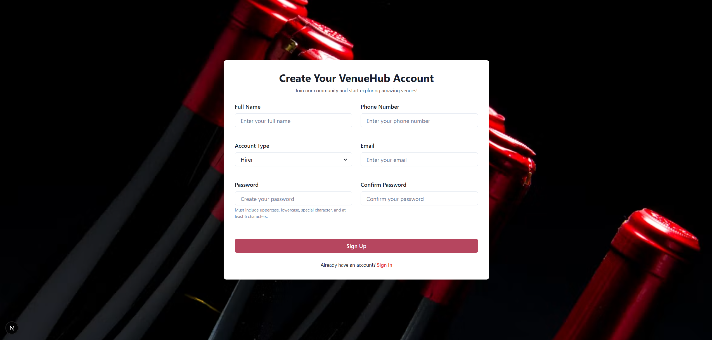
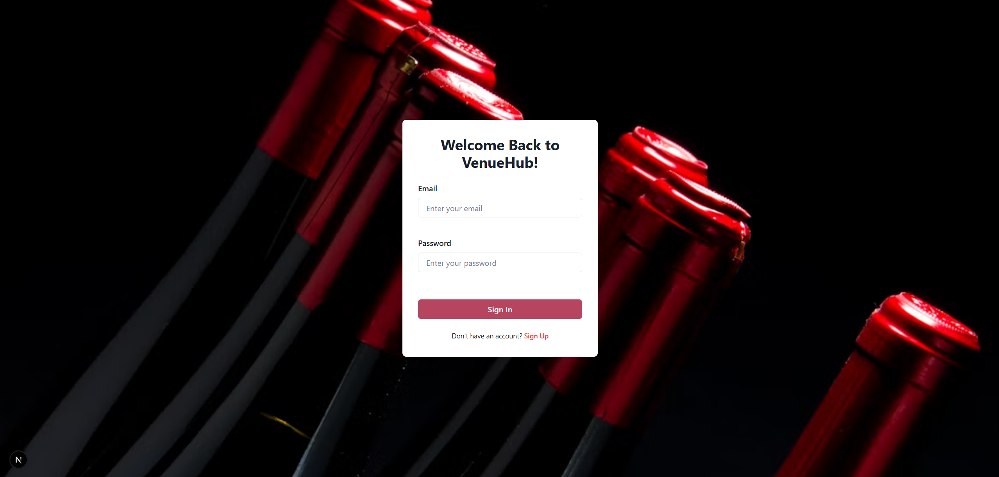

# Venue Booking Platform

A full-stack web application that connects **venue hirers** with **venue vendors**, allowing users to discover venues, manage venue listings, handle bookings, and interact with the platform through role-based features.

This project was originally developed as a **team project at RMIT University during Semester 1, 2026** for the Full Stack Development course.

## Overview

The platform was designed to support two main user groups:

* **Hirers** looking for venues for events
* **Vendors** managing and advertising their venues

The application also includes a separate **admin interface and backend** for administrative functionality.

The project is split into four main applications:

```text
backend/          Main backend API
frontend/         Main user-facing frontend
admin-backend/    Admin backend
admin-frontend/   Admin interface
```

## Features

### Hirer Features

* Create an account and log in
* Browse available venues
* View venue information
* Manage user profile
* Submit ratings and reviews

### Vendor Features

* Create and manage a vendor account
* Manage vendor profile information
* Create venue listings
* Edit existing venue information
* Delete venue listings
* View vendor-related platform information and analytics

### Admin Features

* Separate admin interface
* Administrative venue management
* GraphQL-based backend functionality
* Admin-specific testing and API operations

## Tech Stack

### Frontend

* React
* TypeScript
* HTML
* CSS

### Backend

* Node.js
* Express
* TypeScript
* TypeORM
* REST APIs
* GraphQL

### Database

* Microsoft SQL Server

### Testing

* Jest
* ts-jest
* Supertest
* SQLite

### Development Tools

* Git
* GitHub
* npm


## Team

Developed collaboratively by:

* **Jean Rogers**
* **Linh Le**

RMIT University  
Full Stack Development — Semester 1, 2026

## My Contributions

My main contributions to the project included:

* Developing authentication and user-related functionality
* Contributing to signup and login flows
* Developing vendor profile functionality
* Working on vendor-facing pages and features
* Implementing venue creation, editing, and deletion functionality
* Integrating frontend components with backend APIs
* Contributing to backend functionality using Express, TypeORM, and SQL Server
* Contributing to unit and API testing
* Collaborating through Git and GitHub using branches, commits, and team-based development workflows

> This was a collaborative team project. The features above describe my primary areas of contribution rather than the entire application being solely developed by me.

## Project Structure

```text
venue-booking-platform/
├── frontend/
│   └── Main React frontend
│
├── backend/
│   └── Main Express and TypeORM backend
│
├── admin-frontend/
│   └── Admin-facing frontend
│
├── admin-backend/
│   └── Admin backend and GraphQL functionality
│
└── README.md
```

## Running Locally

The project contains separate frontend, backend, admin frontend, and admin backend applications.

Each service requires its own dependencies and the backend services require SQL Server database configuration through environment variables.

See the `.env.example` files in `backend/` and `admin-backend/` for the required database settings.


## Screenshots

### Hirer Dashboard


### Hirer Saved Venues


### Sign Up


### Sign In


> **Note:** These screenshots were recovered from the original development period and from the locally runnable parts of the project. The original hosted database is no longer available, so some authenticated and data-driven pages could not be reproduced for the portfolio version.


## Known Limitations

This project was developed within the scope and timeframe of a university team assessment.

Some functionality may require additional configuration or development before being considered production-ready.

Areas for future improvement could include:

* Production deployment
* Improved error handling and validation
* Additional automated testing
* Improved responsive design
* More comprehensive authentication and authorisation
* Further accessibility improvements
* Expanded booking and venue-management functionality


## What I Learned

This project gave me practical experience working on a larger full-stack application as part of a development team.

Some of the main areas I gained experience with include:

* Connecting a React frontend to backend APIs
* Building REST API functionality with Express
* Working with TypeORM and SQL Server
* Implementing authentication-related features
* Working with multiple user roles
* Using GraphQL for administrative functionality
* Writing backend tests with Jest and Supertest
* Managing collaborative development through Git and GitHub
* Debugging and integrating work developed across multiple branches

## Attribution

This project was developed collaboratively at **RMIT University** for the **Full Stack Development** course during **Semester 1, 2026**.

It is presented here for portfolio and internship purposes with permission from the course coordinator and project team members.
